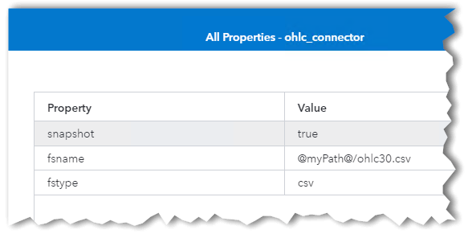

# Forecasting Market Psychology with SAS ESP

## Table of Contents

* [Overview](#overview)
	* [Objectives](#objectives)
	* [Introduction](#introduction)
		* [Candlestick Charts](#candlestick-charts)
		* [Candlesticks](#candlesticks)
			* [Values](#values)
		* [Patterns](#patterns)
			* [Engulfing Bearish](#engulfing-bearish)
			* [Bullish Engulfing](#bullish-engulfing)
			* [Three Black Crows](#three-black-crows)
			* [Three Inside Up](#three-inside-up)
	* [ESP Model Description](#esp-model-description)
		* [User-Defined Properties](#user-defined-properties)
		* [bpiSource Source Window](#bpisource-source-window)
			* [Publisher Connectors](#publisher-connectors)
			* [Schema](#schema)
		* [createGroups Compute Window](#creategroups-compute-window)
			* [Compute Settings](#compute-settings)
			* [Output Schema](#output-schema)
		* [ohlc Aggregate Window](#ohlc-aggregate-window)
			* [Output Schema](#output-schema)
			* [Example](#example)
		* [lastInGroup Filter Window](#lastingroup-filter-window)
			* [Filter](#filter)
			* [Subscriber Connector](#subscriber-connector)
		* [removeState Window](#removestate-window)
		* [Pattern Windows Overview](#pattern-windows-overview)
		* [engulfingBearish Pattern Window](#engulfingbearish-pattern-window)
		* [bullishEngulfing Pattern Window](#bullishengulfing-pattern-window)
		* [threeBlackCrows Pattern Window](#threeblackcrows-pattern-window)
		* [threeInsideUp Pattern Window](#threeinsideup-pattern-window)
	* [Prerequisites](#prerequisites)
	* [Installation](#installation)
	* [Running](#running)
		* [Execute the Model on the ESP server](#execute-the-model-on-the-esp-server)
		* [Import the Dashboard](#import-the-dashboard)
		* [Run Excel Macro to Create Candlestick Chart](#run-excel-macro-to-create-candlestick-chart)
		* [Add the DEVELOPER Tab to the Ribbon](#add-the-developer-tab-to-the-ribbon)
* [Contributing](#contributing)
* [License](#license)
* [Additional Resources](#additional-resources)

## Overview

### Objectives

This is a SAS Event Stream Processing (ESP) enablement project. The following is a list of learning objectives for this project:

- Create groups and stream events to them ensuring all groups contain the same number of events.
- Determine the minimum, maximum, first, and last events in each group.
- Detect specific patterns among groups.

### Introduction

#### Candlestick Charts

In the 1700s, a Japanese man named Honma Munehisa discovered that the price of rice was not only dictated by supply and demand, but also by the emotions of traders. Candlesticks display that market psychology by showing the size of price movements over time. The patterns made by the candlesticks are used to forecast the short-term movement of the market.

A candlestick chart, or Japanese candlestick chart displays price movements over time. A candlestick contains the important information for one trading period. The trading period can be one day, 15 minutes, one hour, or any trading period as long as each candlestick represents the same time period.

When plotted in a candlestick chart, candlestick patterns and trends can indicate the future movement of the market. Each pattern is rated and includes additional information used to reinforce the forecast.

The following is an example of a daily candlestick chart.

 

_Figure 1 - Daily Candlestick Chart_

#### Candlesticks

Each candlestick displays important information about a trading period. The candlestick can be black or white. A black candlestick indicates a loss for the trading period (i.e., the closing value is lower than the opening value) and a white candlestick represents a gain (i.e., the opening value is less than the closing value). The following is an image of two candlesticks showing the terminology and values represented.

 -- 

_Figure 2 - Candlestick Terminology_

The following table defines the terminology used in candlestick charts:

| Term | Definition |
| ------ | ------ |
| Upper Shadow | Also called upper wick. Represents the distance between the top of the real body and the high value for the trading period. Because the opening or closing value can be equal to the high value, the upper shadow does not always exist. |
| Real Body | The area between the opening and closing values. If the real body represents a loss it is black, the opening value is at the top of the body, and the closing value is at the bottom. If it is a gain, the body is white with close at the top and open at the bottom. |
| Lower Shadow | Also called lower wick. Represents the distance between the bottom of the real body and the low value for the trading period. Because the opening or closing value can be equal to the low value, the lower shadow does not always exist. |

##### Values

Each candlestick includes four values about the trading period. The following table lists the four values and what they represent:

| Value | Definition |
| ------ | ------ |
| Open | The first value in a trading period. Can be equal to the high or low values. |
| High | The maximum value for the trading period. Can be equal to the open or close values. |
| Low | The minimum value for the trading period. Can be equal to the open or close values. |
| Close | The last value in a trading period. Can be equal to the high or low values. |

#### Patterns

Patterns in a candlestick chart can be used to forecast the future short-term direction of the price based on the past. The patterns are combined with additional information to strengthen or weaken the forecast.

This project detects four patterns. Those patterns are shown below with the reliability and indication about each pattern. The SAS Event Stream Processing model includes four Pattern windows, one for each of the below patterns. Further descriptions are in later sections:

| Pattern | Reliability | Indication | Forecast Market Direction |
| ------ | ------ | ------ | ------ |
| Engulfing Bearish | Medium | Bearish reversal | Down |
| Bullish Engulfing | Medium | Bullish reversal | Up |
| Three Black Crows | High | Bearish reversal | Down |
| Three Inside Up | High | Bullish reversal | Up |

##### Engulfing Bearish

_Figure 3 - Engulfing Bearish Pattern_

The Engulfing Bearish pattern indicates a bearish reversal and has medium reliability. Occurring during an uptrend, this pattern is characterized by a long black real body engulfing a white real body. The black body does not have to engulf the shadows of the white real body. It indicates that the uptrend has been hurt and the bears are gaining strength.

There are several factors that can increase the reliability of the Engulfing Bearish pattern:

- The white candlestick has a small real body, and the black candlestick has a large real body.
- The pattern appears after a very fast move.
- The second candlestick engulfs more than one real body.

##### Bullish Engulfing

_Figure 4 - Bullish Engulfing Pattern_

The Bullish Engulfing pattern indicates a bullish reversal and has medium reliability. During a downtrend, this pattern is characterized by a long white real body engulfing a black real body. The white body does not have to engulf the shadows of the black real body. It indicates that the downtrend has lost momentum and the bulls are gaining strength.

There are several factors that can increase the reliability of the Bullish Engulfing pattern:

- The black candlestick has a small real body, and the white candlestick has a large real body.
- The pattern appears after a very fast move.
- The second candlestick engulfs more than one real body.

##### Three Black Crows

_Figure 5 - Three Black Crows Pattern_

The Three Black Crows pattern signifies a bearish reversal with a high reliability. During an uptrend, there are three long black candles with consecutively lower closes. This signifies that the market has been at a high price for too long and investors are starting to compensate for it. 

##### Three Inside Up

_Figure 6 - Three Inside Up Pattern_

The Three Inside Up pattern signifies a bullish reversal with a high reliability. The first two candles form a Harami bullish pattern. It is signified by a small white real body within a prior relatively long black real body. Harami is the old Japanese word for pregnant. The long black candlestick is the mother, and the small white candlestick is the child.

The third candle is a white candle with a higher close than the second candle and is the confirmation for the bullish reversal. The smaller the second candle the better the reliability.

### ESP Model Description

This section details each window of the ESP model for the project.

_Figure 7 - ESP Model_

#### User-Defined Properties

You can create user-defined properties at the project level of a project. These properties then can be referenced using a token. In this example there is a user-defined property named `myPath`. The value of the property is the path to the files used by the project. Each time you use the `@myPath@` token the value is substituted. 

_Figure 8 - User-Defined Properties_

#### bpiSource Source Window

The `bpiSource` Source window receives the input stream by way of an API call (live) using a URL connector, or by way of a csv file. The window is stateless (no index), accepts only insert events, and automatically generates the key field because there is no key field in the input data.

_Figure 9 - bpiSource State and Event Type_

##### Publisher Connectors

The `bpiSource` window includes two Input Data (Publisher) Connectors, one for the live feed and one for the csv file. Only one of the connectors can be active at a time.

_Figure 10 - bpiSource Publisher Connectors_

The `bpiIn` connector is a URL connector that uses a `config.xml` file for control. Refer to [Using the URL Publisher Connector](https://go.documentation.sas.com/doc/en/espcdc/v_013/espca/n1kxssbs6k3y3hn1uy5axffyndb1.htm) in the ESP documentation. The connector is configured to make an API call once every minute to retrieve the latest bitcoin price.

The `csv_connector` is a file socket connector that reads a csv file. The csv file is a recording of several days of bitcoin prices. Refer to [Using the File and Socket Connector and Adapter](https://go.documentation.sas.com/doc/en/espcdc/v_013/espca/n117h5f4vqvnk0n11rthjpnzrrcz.htm) in the ESP documentation.

##### Schema

The output schema for the `bpiSource` window contains two fields, `price` and `id`. The `id` field is automatically generated and is the key. `Price` is the only field read from the connector.

_Figure 11 - bpiSource Schema_

#### createGroups Compute Window

A candlestick chart requires equal time periods. Therefore, equal size groups are used to define each time period. In this example, we are using 60 minutes as the time period. That means each group should include 60 events since the project receives an event once per minute.

The `createGroups` Compute window creates the groups, identifies the beginning and end of each group, and specifies how many events are in each group. This is done by way of expressions.

##### Compute Settings

The Compute window allows you to use an engine initialization expression to define variables, set initial values, and more. The initialization expression is executed once when the project is started. The following is the initialization expression for this example:

~~~
integer p;

integer s;

p = 0;

s = 0;
~~~

Variables `p` and `s` are defined as integers and set to an initial value of 0.

##### Output Schema

The Compute window allows you to pass fields through or create new event fields using expressions. The following is the output schema for the `createGroups` window:

_Figure 12 - createGroups Output Schema_

Fields `id` and `price` are passed through to the next window. Fields `count`, `mod`, and `group` are calculated using expressions. The expression for `count` is `p = p + 1; return p`. This is simply the event number.

Field `mod` is used to define the beginning and end of each group. The expression for `mod` is `s = p % 60; return s`. Therefore, field `mod` will contain the remainder of `p` divided by 60. When `mod` is 0 it identifies the beginning of a new group, and when `mod` is 59 it signifies the end of the group.

The final field created by the `createGroups` window is `group`. This is the group number for each group and is calculated by the expression, `ceil(p / 60)`. Each group number is defined as the value of `p` divided by 60 rounded up to the nearest integer.

#### ohlc Aggregate Window

The `ohlc` Aggregate window creates the `open`, `high`, `low`, and `close` values for each group. This done by applying aggregate functions to the field `price` in each event. `Group` is the key field. Therefore, the aggregate functions keep updating until the end of the group is reached. The fields are then reset for the next group.

##### Output Schema

The expressions used to calculate the values of the new fields are in the output schema for the window.

_Figure 13 - ohlc Output Schema_

As you can see, `group` is the key field and `mod` is passed through by using the `ESP_aLast` aggregate function which is the most recent value of `mod`.

The four calculated fields, `open`, `high`, `low`, and `close` all use aggregate functions to create their values. Remember, the fields are reset when the first event of a new group is input. 

The field `open` is calculated by applying the `ESP_aFirst` aggregate function to `price`. This should output the first value in the group when the end of the group is reached. The field `high` is calculated by applying the `ESP_aMax` aggregate function. This is the maximum value for the group. Field `low` is the opposite. The `ESP_a_Min` aggregate function returns the minimum value for the group. Finally, field `close` represents the value in the last event of the group.

##### Example

The following figure illustrates the aggregate functions as they apply to each event. It shows the input events from the `createGroups` window and the output events from the `ohlc` window.

_Figure 14 - ohlc Example_

The first event received has a `price` of 4000, a `count` value of 1, `mod` value of 1, and `group` value of 0. The field `group` is the key field and is passed through to the output. The field `mod` uses the `ESP_aLast` aggregate function, which passes through the most recent value to the output without modification. The `open`, `high`, `low`, and `close` values are all 4000 because this is the first event in the group.

The second event has a `price` value of 3000. The `count` and `mod` values are incremented, and the `group` value remains at 0. The other four calculated output fields are updated. `Open` remains at 4000 and will for the entire group. The value of `high` remains at 4000. The `low` value is updated to 3000, and `close` is also set to 3000.

In the third event the `price` value is 5000 which is the highest value yet. The `high` and `close` values are updated to 5000 while `open` and `low` remain the same.

Let’s skip to the event with a `count` of 58 and `price` of 6000. The `open` value remains the same as expected. `High` is updated to a new value of 6000, `low` stays at 3000 and `close` is updated to 6000. 

`Count` 59 is the last event in the group. Therefore, the final values for `group` 0 are 4000 for `open`, 6000 for `high`, 3000 for `low`, and 3500 for `close`. These are the values used to construct a candlestick for group 0. The next event resets the four calculated values and creates a new group.

#### lastInGroup Filter Window

The `lastInGroup` Filter window passes through the last event in each group. This is the event containing the final `open`, `high`, `low`, and `close` values for the group. Filter windows pass events through if the filter condition is met. Therefore, the input and output schema are the same.

##### Filter

The `lastInGroup` window uses an expression as the filter. The following shows the expression used to select the last event in each group:

_Figure 15 - lastInGroup Filter Expression_

##### Subscriber Connector

The `lastInGroup` window includes a subscriber connector that creates a csv file (`ohlc30.csv`). The file contains the `group`, `mod`, `open`, `high`, `low`, and `close` values for each group. This file can be used to [create a candlestick chart in Microsoft Excel](https://gitlab.sas.com/IOT/tutorials/ESP-tutorials/forecasting-investor-emotions-with-sas-esp/-/blob/master/README.md#run-excel-macro-to-create-candlestick-chart) using the provided macro.

_Figure 16 - lastInGroup Subscriber Connector_

#### removeState Window

The model for this example contains four Pattern windows. Pattern windows accept only Insert events. The `ohlc` Aggregate window outputs Update events. Therefore, the Update events need to be converted to Insert events. This is done by way of the `removeState` window.

A Remove State window converts Update events to Insert events. The `ohlc` Aggregate window uses an index and makes the model stateful from that point on. The `removeState` window makes the model stateless. For more information about the Remove State window, refer to [Using Remove State Windows](https://go.documentation.sas.com/doc/en/espcdc/v_013/espcreatewindows/p0usk3uf3bcnebn1m99g1jbvvhxu.htm) in the ESP documentation.

#### Pattern Windows Overview

There are four Pattern windows that are part of this model. They are `engulfingBearish`, `bullishEngulfing`, `threeBlackCrows`, and `threeInsideUp`. These names correspond to the names of the candlestick patterns each window detects. Each window is discussed individually below.

Each pattern contains Events of Interest (EOI) and logic to set the overall conditions by which the pattern is matched. EOIs can be assembled into an expression that uses logical operators. Each EOI includes a where clause and resolves to either true or false. The logic links the EOIs together using a operators.

For example, a pattern contains two EOIs named `e1` and `e2`. Each includes the conditions by which it is considered true. The logic for the example is, `fby(is(e1), is(e2))`. What this means is that `e1` must be true followed by `e2` being true for the next event. The `is` operator allows you to construct logic using consecutive events. The `fby` operator indicates that the EOIs must occur in a specific order. 

EOIs use binding variables to allow a value from one EOI to be used in another EOI. The requirement is that binding variables always be to the left of the operator. Binding variables allow you to compare values among multiple events.

Refer to the [Using Pattern Windows](https://go.documentation.sas.com/doc/en/espcdc/v_013/espcreatewindows/n1rj6nmwuzuxisn12tjeu0o336tt.htm) in the ESP documentation for more information on using pattern windows.. Refer to the demonstration video to see the Pattern editor being used.

#### engulfingBearish Pattern Window

The `engulfingBearish` Pattern window looks for the Engulfing Bearish pattern and outputs an event if the pattern is detected. 

_Figure 17 - Engulfing Bearish Pattern_

The `engulfingBearish` pattern includes three EOIs. Based on the logic, the first EOI `e1` must be true, immediately followed by EOI `e2` being true, immediately followed by the third EOI `e3` being true.

The definition of the `engulfingBearish` pattern is: “Occurring during an uptrend, this pattern is characterized by a long black real body engulfing a white real body”. The following table lists each EOI and provides the expression and explanation of each.

| EOI | Expression | Description |
| ------ | ------ | ------ |
| e1 | `open < close` | Uptrend in the market |
| e2 | `open < close and (open/close) < 0.995 and c2 == close and o2 == open` | White real body (`open < close`) with a gain of at least 0.5%. Binding variables `c2` and `o2` are created. |
| e3 | `c2 < open and o2 > close and close < open and (close/open) < 0.995` | Black real body (`close < open`) engulfing (`c2 < open`, `o2 > close`) |

The following image shows the output schema for the `engulfingBearish` Pattern window.

_Figure 18 - Engulfing Bearish Schema_

Pattern mappings can either be field selections or field expressions. In field selection you select the EOI and the value from it. For field expressions an expression is entered using the fields from the selected EOI.

For the `engulfingBearish` schema, `group` is the group value from EOI `e3`. The `open` and `close` values are output for `e2` and `e3`. An expression is used to calculate the percent difference between the `open` and `close` values for EOIs `e2` and `e3`.

#### bullishEngulfing Pattern Window

The `bullishEngulfing` Pattern window looks for the Bullish Engulfing pattern and outputs an event if the pattern is detected. 

_Figure 19 - Bullish Engulfing Pattern_

The `bullishEngulfing` pattern includes three EOIs. Based on the logic, the first EOI `e1` must be true, immediately followed by EOI `e2` being true, immediately followed by the third EOI `e3` being true.

The definition of Bullish Engulfing is “During a downtrend, this pattern is characterized by a long white real body engulfing a black real body”. The following table lists each EOI and provides the expression and explanation of each.

| EOI | Expression | Description |
| ------ | ------ | ------ |
| e1 | `close < open` | Downtrend in the market |
| e2 | `close < open and (close/open) < 0.995 and c == close and o == open` | Black real body (`close < open`) with a loss of at least 0.5%. Binding variables `c` and `o` are created. |
| e3 | `c > open and o < close and open < close and (open/close) < 0.995` | White real body (`open < close`) engulfing (`c > open`, `o < close`) |

The following image shows the output schema for the `bullishEngulfing` Pattern window.

_Figure 20 - Bullish Engulfing Schema_

For the `bullishEngulfing` schema, `group` is the group value from EOI `e3`. The `open` and `close` values are output for `e2` and `e3`. An expression is used to calculate the percent difference between the `open` and `close` values for EOIs `e2` and `e3`.

#### threeBlackCrows Pattern Window

The `threeBlackCrows` Pattern window looks for the Three Black Crows pattern and outputs an event if the pattern is detected. 

_Figure 21 - Three Black Crows Pattern_

The `threeBlackCrows` pattern includes four EOIs. Based on the logic, the first EOI `e1` must be true, immediately followed by EOI `e2` being true, immediately followed by the third EOI `e3` being true., immediately followed by EOI `e4`.

The definition of Three Black Crows is “During an uptrend, there are three long black candles with consecutively lower closes”. The following table lists each EOI and provides the expression and explanation of each.

| EOI | Expression | Description |
| ------ | ------ | ------ |
| e1 | `open < close and c1 == close` | Uptrend in market. Create binding variable `c1`. |
| e2 | `close < open and (close/open) < 0.995 and c1 > close and c2 == close` | Black real body (`close < open`) with a loss of at least 0.5%. Lower `close` than previous candle. Binding variable `c2` is created. |
| e3 | `close < open and (close/open) < 0.995 and c2 > close and c3 == close` | Black real body (`close < open`) with a loss of at least 0.5%. Lower `close` than previous candle. Binding variable `c3` is created. |
| e4 | `close < open and (close/open) < 0.995 and c3 > close` | Black real body (`close < open`) with a loss of at least 0.5%. Lower `close` than previous candle. |

The following image shows the output schema for the threeBlackCrows Pattern window.

_Figure 22 - Three Black Crows Schema_

For the `threeBlackCrows` schema, `group` is the group value from EOI `e4`. The `close` values are output for `e2`, `e3`, and `e3`. An expression is used to calculate the percent difference between the `open` and `close` values for EOIs `e2`, `e3`, and `e4`.

#### threeInsideUp Pattern Window

The `threeInsideUp` Pattern window looks for the Three Inside Up pattern and outputs an event if the pattern is detected. 

_Figure 23 - Three Inside Up Pattern_

The `threeInsideUp` pattern includes three EOIs. Based on the logic, the first EOI `e1` must be true, immediately followed by EOI `e2` being true, immediately followed by the third EOI `e3` being true.

The definition of Three Inside Up is “Small white real body within a prior relatively long black real body. The third candle is a white candle with a higher close than the second candle.“ The following table lists each EOI and provides the expression and explanation of each.

| EOI | Expression | Description |
| ------ | ------ | ------ |
| e1 | `close < open and (close/open) / 0.995 and o == open and c == close` | Black real body (`close < open`) with a loss of at least 0.5%. Binding variables `c` and `o` are created. |
| e2 | `o > close and c < open and open < close and (open/close) < 0.995 and c1 == close and o1 == open` | White real body (`open < close`) with a gain of at least 0.5% . `Open` and `close` are within prior candle. Binding variables `c1` and `o1` are created. |
| e3 | `c1 < close and open < close and (open/close) < 0.995` | White real body (`open < close`) with a gain of at least 0.5%. `Close` is greater than the previous `close`. |

The following image shows the output schema for the `threeInsideUp` Pattern window.

_Figure 24 - Three Inside Up Schema_

For the `threeInsideUp` schema, `group` is the group value from EOI `e3`. The `open` and `close` values are output for `e1` and `e2`. The `close` value for EOI `e3` is also output. An expression is used to calculate the percent difference between the `open` and `close` values for EOIs `e1` and `e2`.

### Prerequisites

[SAS Event Stream Processing 2021.1.5](https://www.sas.com/en_us/software/event-stream-processing.html)

### Installation

Use the following steps to install the project:

1. Download all the files in the [files](https://gitlab.sas.com/IOT/tutorials/ESP-tutorials/forecasting-investor-emotions-with-sas-esp/-/tree/master/files) directory of this repository.

1. Create a directory on the server to which ESP has read and write access.

> Contact your system administrator to determine the appropriate directory to use.

3. Upload the `config.xml` and `bpi_out5.csv` files to the directory you just created.

4. Import the `bitcoin.xml` file to SAS Event Stream Processing Studio For instructions, refer to the [Import a Project](https://go.documentation.sas.com/doc/en/espcdc/v_014/espstudio/n0qhr0p800gs68n18wbp96pu7txq.htm) section in the ESP documentation.

5. Edit the `myPath` value in the User-Defined Properties of the project as follows:

    - If neccessary, click  to go to the project properties.

    - Expand **User-Defined Properties**.

    - Edit the value for the `myPath` property to be the path where your files are located.

    

    _Figure 25 - User-Defined Properties_

### Running

#### Execute the Model on the ESP server

The following steps are used to execute the model on the ESP Server:

1. Open the project, select the **bpiSource** window, and expand **Input Data (Publisher) Connectors**.

1. Make the appropriate connector active. Ensure only one connector is active.

1. Click **ESP Servers**.

1. Click  and then **Load and start project in cluster**. The Load and Start Process screen appears.

_Figure 26 - Load and Start Project in Cluster_

5. Ensure the appropriate project is selected and click **OK**. The ESP server will start and then the project will start. 

#### Import the Dashboard

This project includes a dashboard that you can import into SAS ESP Streamviewer.

> The project must be running to see data streaming on the dashboard. Refer to [Execute the Model on the ESP server](#execute-the-model-on-the-esp-server) for instructions.

1. Click  to open the Import Data screen.

1. Click **Choose File**.

1. Navigate to the `dashboard.xml` file and click **Open**.

1. Click **OK** and then click **OK** again to close all screens. The dashboard should be displayed. You may have to click Refresh to view streaming data.

_Figure 27 - Dashboard_

#### Run Excel Macro to Create Candlestick Chart

The files in this repository include a Visual Basic (.bas) file that you can import into Microsoft Excel. Once imported, the file becomes an Excel macro that will create a candlestick chart based on the data in the `ohlc30.csv` file. The `ohlc30.csv` file is written by the ESP model and contains the `open`, `high`, `low`, and `close` values for each time period. (60 minutes in this example).

> You must create the `ohlc30.csv` file using the `csv_connector` publisher connector.

Use the following steps to create a candlestick chart based on the `ohlc30.csv` file:

1. Open the `ohlc30.csv` file in Microsoft Excel.

1. Click the **DEVELOPER** tab on the ribbon. If you do not have a DEVELOPER tab on your ribbon, refer to the [Adding the DEVELOPER Tab to the Ribbon](https://gitlab.sas.com/IOT/tutorials/ESP-tutorials/forecasting-investor-emotions-with-sas-esp/-/blob/master/README.md#adding-the-developer-tab-to-the-ribbon) section. After you complete those steps, click the **DEVELOPER** tab.

1. Click **Visual Basic** (left most command on the DEVELOPER tab) to open the Visual Basic editor.

1. Click **File --> Import File**. Navigate to the location of the `Module1.bas` file, select it, and click **Open**. The file is imported.

1. Click **File --> Close and Return to Microsoft Excel** to close the Visual Basic editor.

1. On the DEVELOPER tab, click **Macros**.

1. Ensure the **OHLC** macro is selected and click **Run**. The candlestick chart should appear.

#### Add the DEVELOPER Tab to the Ribbon

Use the following steps if you do not have the DEVELOPER tab on your Excel ribbon. If you have the DEVELOPER tab on the ribbon, you can skip these steps:

1. Click **File --> Options** to display the Excel Options screen.

1. Click **Customize Ribbon**.

1. Under Main tabs, click the checkbox next to **Developer**. 

1. Click **OK**. The DEVELOPER tab is added to the ribbon.

## Contributing

> We welcome your contributions! Please read [CONTRIBUTING.md](CONTRIBUTING.md) for details on how to submit contributions to this project. 

## License

> This project is licensed under the [Apache 2.0 License](LICENSE).

## Additional Resources

- [SAS Event Stream Processing 2021.1.5 Documentation](https://go.documentation.sas.com/doc/en/espcdc/v_014/espwlcm/home.htm)

- [Investing.com Bitcoin US Dollar Candlestick Patterns](https://www.investing.com/crypto/bitcoin/btc-usd-candlestick#)
